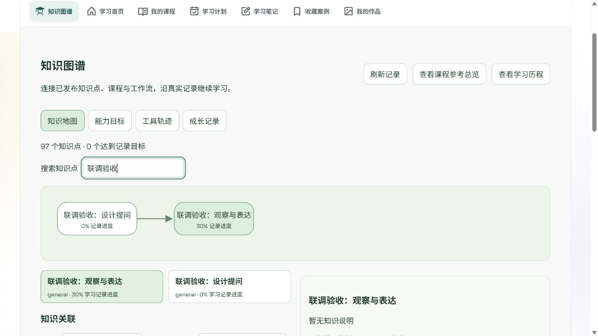

# 知识图谱合并与数据库闭环（2026-10-08）

## 云端合并

合并 GitHub main 608deee（课程知识绑定、课程参考总览、依赖修补），同时保留原有本地集成、ComfyUI 和跳转反馈修复。本地未提交工作先以 2fff73f 保存，合并提交为 8143d80。

## 修复结果

- `/my-learning` 默认读取真实知识库，展示知识点、关系、关联资源及有依据的推荐。
- `/admin/knowledge` 为教师/管理员提供知识点、前置/相关关系、资源绑定和能力目标维护。
- 学习地图、能力目标、工具轨迹和成长记录接入对应服务端接口；课程参考总览及原有学习历程保留。
- `/me/knowledge-path` 维护按账号隔离的有序学习路径，校验重复、未发布节点及前置顺序。已保存路径优先用于推荐。
- 学习/练习/创作活动入库；记录进度不等于教师评分或能力认证。
- 已发布课程、课时和工作流的明确标签同步生成知识节点。数据库触发器处理后续新增、修改、发布和归档；手动关联不会被标签同步删除。
- 课程标签仅表示覆盖，不会因课程完成自动认定每个标签已掌握；绑定多课时采用平均进度，向下取整。退出选课、失败/取消及未发布版本运行不增加知识进度。旧运行依照实际版本标签判断，不借用新版本标签。
- 学生资源绑定只返回已发布目标；课时同时验证父课程发布状态。无资源知识点不生成无法执行的推荐。
- 工作流合并保留原生引擎、分组、学习关联字段。另修复保存时学习字段处理覆盖 override 定义的问题。

## 数据库与内容

新增迁移：`0035_knowledge_learning_paths.sql`、`0036_knowledge_label_sync_triggers.sql`。已有 `0033_knowledge_map.sql` 是基础知识库，新增迁移扩展路径、来源及自动同步。

本地 PostgreSQL 已应用最新迁移。执行 `npm --prefix apps/api run knowledge:import-atlas`，将云端人工整理的课程目录知识点与数据库课程按唯一规范化标题匹配：10 门已发布课程、95 个知识点引用。重复运行成功，不改学习进度，不生成不存在的课程，不绑定未知课时。相关连线是编辑关联，未转换成硬性前置。知识说明仍需教师按实际教学确认。

生产部署需要在目标环境运行：

```
npm run db:migrate
npm --prefix apps/api run knowledge:import-atlas
```

目标环境中未匹配或有歧义的课程会跳过并报告；不会借此自动补造课程内容。

## 验证

完整 `npm run check`：API 类型检查、前端生产构建、262 项回归通过（API130、Sites6、chat36、platform77、导入7、可靠性6）。

`npm --prefix apps/api run verify:knowledge` 在真实本地 PostgreSQL 验证11项：角色限制、标签自动建库及真实地址、多课时进度、课程标签覆盖、退出选课、循环关系回滚、路径顺序/持久化/账号隔离、重复输入、已发布运行证据、草稿过滤、下架资源和四视图SQL。测试数据整体回滚，不残留。

浏览器使用真实 API、数据库和临时本地账号验证：管理员创建并发布知识点、关系与课程绑定刷新保留；学生组装路径保存刷新恢复；学习活动进入成长记录；搜索同步过滤图及列表。临时账号、课程和验收节点在完成后清理，不调用外部模型。



## 仍需后续验收的边界

本次是数据库知识图谱、规则推荐和学习路径闭环。Graph RAG、自动知识抽取、教师能力评测、独立模块跨课程组装、工具目录与 tools 实体全面统一、正式课程/版权内容验收仍属后续工作。

仅在本地执行数据库迁移和内容匹配；GitHub推送不会自动证明服务器数据库已迁移，也不代表生产部署完成。开发阶段安全配置按原范围暂缓。

桌面的ArtEdu临时脚本/日志将清理；原有教师PPT及审核资料搬入忽略的 `local-artifacts/desktop-cleanup-20261008` 留存，不上传GitHub。
