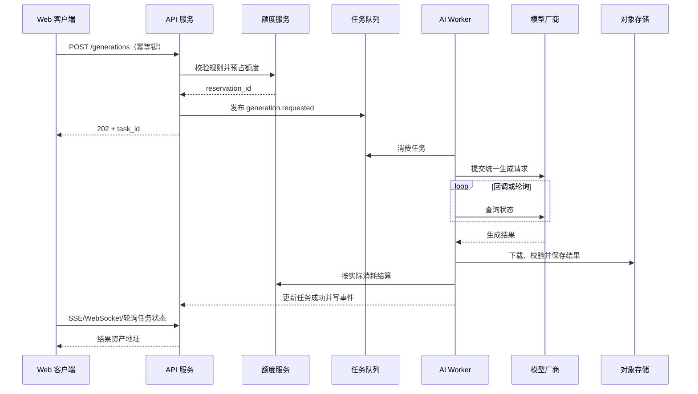

# AI 艺术智慧平台：代码与系统架构

## 1. 目标与边界

平台包含三大前台功能区和一个管理后台：

- 首页创作：用户选择创作类型与大模型，输入提示词或跟随推荐开始创作。
- 资源库：展示课程、素材、案例和工作流；管理员可上传，用户可投稿案例。
- 工作流：把创作过程拆成可学习、可执行、可保存进度的步骤。
- 管理后台：管理用户、角色、模型、额度、资源、工作流、审核和审计日志。

首期建议支持文本生图、图生图和文本辅助；视频、3D 等类型通过相同任务协议后续扩展。

## 2. 总体架构决策

| 层次 | 推荐技术 | 说明 |
|---|---|---|
| Web 前台/后台 | Next.js + TypeScript | 前台、个人中心和管理后台共享组件与类型 |
| API 服务 | NestJS + TypeScript | 模块边界清晰，适合 RBAC、队列和管理后台 API |
| 主数据库 | PostgreSQL | 事务、JSONB、全文/模糊检索、审计数据均适配 |
| 缓存/队列 | Redis + BullMQ | 限流、会话缓存、异步生成、失败重试 |
| 文件存储 | S3 兼容对象存储（生产）/ MinIO（开发） | 原图、缩略图、课程附件、生成结果不进入数据库 |
| AI 接入 | Provider Adapter | 对不同厂商模型统一参数、任务状态和错误码 |
| 可观测性 | OpenTelemetry + 指标/日志/链路平台 | 追踪一次生成从 API 到第三方模型的完整链路 |

## 3. 逻辑组件

```mermaid
flowchart LR
    U[普通用户] --> WEB[Web 前台]
    A[平台管理员/审核员] --> ADMIN[管理后台]
    WEB --> API[API 应用]
    ADMIN --> API

    subgraph API应用：模块化单体
      AUTH[认证与 RBAC]
      LIB[资源库]
      WF[工作流]
      AIGW[AI 模型网关]
      QUOTA[额度与计量]
      MOD[内容审核]
      FILE[文件资产]
    end

    API --> PG[(PostgreSQL)]
    API --> REDIS[(Redis)]
    API --> OBJ[(对象存储)]
    AIGW --> Q[生成任务队列]
    Q --> WORKER[AI Worker]
    WORKER --> P1[模型厂商 A]
    WORKER --> P2[模型厂商 B]
    WORKER --> P3[校内/自建模型]
    WORKER --> OBJ
    WORKER --> PG
```

核心原则：Web 请求只负责校验、预占额度和创建任务；耗时模型调用由 Worker 完成，避免 HTTP 超时和重复扣费。

## 4. 推荐 Monorepo 目录

```text
ai-art-platform/
├─ apps/
│  ├─ web/                       # 用户前台：主页、资源库、工作流、创作台
│  │  └─ src/
│  │     ├─ app/                 # Next.js 路由
│  │     ├─ features/            # creator/library/workflow/account
│  │     ├─ components/
│  │     └─ lib/                 # API client、鉴权、埋点
│  ├─ admin/                     # 管理后台，可与 web 独立部署
│  │  └─ src/features/           # users/models/quotas/reviews/resources/audit
│  ├─ api/                       # NestJS 模块化单体
│  │  └─ src/modules/
│  │     ├─ auth/
│  │     ├─ iam/                 # 用户、组织、角色、权限
│  │     ├─ ai-gateway/          # 统一生成协议与模型路由
│  │     ├─ quota/               # 限额、预占、结算、账本
│  │     ├─ workflow/
│  │     ├─ resource/
│  │     ├─ moderation/
│  │     ├─ asset/
│  │     ├─ notification/
│  │     └─ audit/
│  └─ ai-worker/                 # 消费生成任务；可独立扩缩容
│     └─ src/
│        ├─ processors/
│        ├─ providers/
│        └─ safety/
├─ packages/
│  ├─ contracts/                 # DTO、事件、枚举；前后端共享
│  ├─ ui/                        # 设计系统
│  ├─ config/                    # ESLint/TS/环境配置
│  ├─ database/                  # ORM schema、migration、seed
│  ├─ observability/             # 日志、指标、trace
│  └─ testing/                   # fixtures、test containers
├─ infra/
│  ├─ docker/
│  ├─ k8s/                       # 规模化后再启用
│  └─ terraform/
└─ docs/
```

如果团队较小，`web` 与 `admin` 可以先合并为一个 Next.js 应用，以路由组和权限守卫隔离。

## 5. 后端模块职责

### 5.1 IAM（身份和权限）

- 用户、学校/组织、角色、权限、登录会话。
- 默认角色：`platform_admin`、`org_admin`、`reviewer`、`instructor`、`user`。
- 权限使用细粒度动作，例如 `resource.review`、`workflow.publish`、`quota.manage`、`model.manage`。
- 服务端鉴权是最终边界；前端隐藏按钮只改善体验，不能替代鉴权。

### 5.2 AI Gateway（模型网关）

业务层只能依赖统一接口，不直接调用厂商 SDK：

```ts
export interface GenerationProvider {
  submit(request: UnifiedGenerationRequest): Promise<ProviderJob>;
  query(providerJobId: string): Promise<ProviderJobStatus>;
  cancel?(providerJobId: string): Promise<void>;
  normalizeError(error: unknown): UnifiedProviderError;
}

export type UnifiedGenerationRequest = {
  taskType: 'text' | 'text_to_image' | 'image_to_image' | 'video';
  modelCode: string;
  prompt: string;
  negativePrompt?: string;
  inputAssetIds?: string[];
  parameters: Record<string, unknown>;
  idempotencyKey: string;
};
```

模型表保存能力描述和参数 JSON Schema。前端根据 Schema 动态渲染尺寸、步数、比例、LoRA 等控件，避免每增加一个模型就改页面。

### 5.3 Quota（额度与计量）

- 管理员可按平台、组织、角色、用户配置周期额度和并发限制。
- `quota_policy` 表示规则，`quota_usage_bucket` 表示周期用量，`credit_ledger` 表示不可变流水。
- 创建任务时先在事务内“预占”；成功后按实际消耗“结算”；失败或取消则“释放”。
- 所有扣费操作带幂等键，Worker 重试不能重复扣费。

### 5.4 Workflow（教学工作流）

- 工作流定义与发布版本分离：已开始学习的用户永远绑定具体版本。
- 步骤类型包括说明、参数填写、AI 生成、文件上传、人工确认和导出。
- `config_json` 描述步骤参数、默认模型、提示词模板、输入输出映射。
- 运行态单独存储，可暂停、继续、重试，不污染模板。

### 5.5 Resource（资源库）

- 统一资源主表承载课程、案例、素材、文章，再以扩展表保存各自字段。
- 投稿状态：草稿 → 待审核 → 已发布/已驳回 → 已归档。
- 用户只能编辑自己的草稿或被驳回稿；进入审核后锁定版本，修改需撤回或新建版本。

### 5.6 Moderation（审核）

- 支持机器预审与人工审核；人工决定保留理由、快照和审核人。
- 审核对象可扩展为资源、头像、提示词、生成结果。
- 删除/下架与“审核驳回”分离，便于追责和申诉。

## 6. 一次 AI 生成的完整链路



关键一致性策略：数据库事务内创建任务与 Outbox 事件；独立发布器把 Outbox 送入队列，避免“已扣额度但任务未入队”。

## 7. 核心 API 草案

当前 Express MVP 已在 `/api` 下实现课程目录、详情、选课、学习进度、课程 CMS、文件登记、发布审核、搜索推荐、运营统计，以及课程工作流步骤的模型与额度校验。下列 `/v1` 路径是生产服务稳定后建议采用的版本化协议。

### 用户端

```text
POST   /v1/auth/login
GET    /v1/models?capability=text_to_image
POST   /v1/generations
GET    /v1/generations/:id
POST   /v1/generations/:id/cancel

GET    /v1/workflows
GET    /v1/workflows/:slug
POST   /v1/workflows/:id/runs
PATCH  /v1/workflow-runs/:id/steps/:stepKey

GET    /v1/resources
GET    /v1/resources/:slug
POST   /v1/resources                 # 新建草稿
POST   /v1/resources/:id/submit      # 提交审核
POST   /v1/resources/:id/favorite

POST   /v1/assets/upload-intents     # 获取对象存储预签名地址
POST   /v1/assets/complete
GET    /v1/me/quota
```

### 管理端

```text
GET    /v1/admin/users
PATCH  /v1/admin/users/:id/status
PUT    /v1/admin/users/:id/quota-policy
CRUD   /v1/admin/models
CRUD   /v1/admin/workflows
CRUD   /v1/admin/resources
GET    /v1/admin/reviews
POST   /v1/admin/reviews/:id/approve
POST   /v1/admin/reviews/:id/reject
GET    /v1/admin/audit-logs
```

所有写接口接收 `Idempotency-Key`；列表采用游标分页；管理员导出操作进入异步任务。

## 8. 状态机

### 生成任务

```text
queued -> running -> succeeded
   |         |          |
   +-------> failed <----+
   |         |
   +-------> cancelled
```

数据库更新必须校验合法的前置状态，例如只有 `queued/running` 可取消。

### 投稿资源

```text
draft -> pending_review -> published
   ^          |
   |          +-> rejected
   |                 |
   +-----------------+
published -> archived
```

## 9. 安全与合规

- 厂商 API Key 只存在密钥管理系统中，数据库仅保存引用名；严禁下发浏览器。
- 上传使用短时预签名 URL，完成后校验 MIME、文件头、大小、哈希，并异步扫描。
- 对提示词、输入图和输出图执行安全策略；命中风险时不公开结果并进入复核。
- 下载私有资产使用短时签名 URL；公开资源走 CDN。
- 密码使用强哈希；Refresh Token 只保存哈希；后台账号建议强制 MFA。
- 日志脱敏，不记录完整 Token、厂商 Key、私密提示词和未公开作品 URL。
- 管理员操作、额度变更、审核决定全部写不可篡改的审计记录。

## 10. 缓存、搜索与性能

- Redis：会话、热点资源详情、权限快照、频率限制、生成状态短缓存。
- PostgreSQL：首期使用结构化筛选加 trigram/全文检索；资源达到百万级或需要复杂中文分词时再引入 OpenSearch。
- 资源列表采用 `(status, published_at, id)` 游标分页，避免大偏移量分页。
- 图片入库后生成多尺寸 WebP/AVIF 缩略图，列表页不加载原图。
- AI Worker 按厂商和模型设置独立并发，使用指数退避和熔断器。

## 11. 测试策略

- 单元测试：额度计算、权限判定、状态机、模型参数适配。
- 集成测试：PostgreSQL/Redis/对象存储；验证事务、幂等与并发预占。
- 契约测试：每个 Provider Adapter 对统一请求和错误码的映射。
- E2E：登录 → 跟随工作流 → 生成 → 保存案例 → 投稿 → 管理员审核。
- 故障演练：厂商超时、重复回调、队列重复投递、结算失败、文件下载失败。

## 12. 分阶段实施

### MVP

- 单组织或轻量多组织、5 类角色。
- 2 个模型供应商、文本生图/图生图。
- 固定步骤工作流、进度保存。
- 课程/案例/素材、人工审核。
- 用户级月额度与管理员调整、基础审计。

### 第二阶段

- 可视化工作流编排、工作流复制与版本比较。
- 机器内容审核、教师课程包、评论收藏、推荐。
- 组织级报表、成本中心、模型路由策略。

### 规模化阶段

- 将 AI Worker、搜索、媒体处理拆分服务。
- 多地域对象存储/CDN、细粒度数据保留策略。
- 按模型成本与质量自动路由，建设评测集和质量回归。
