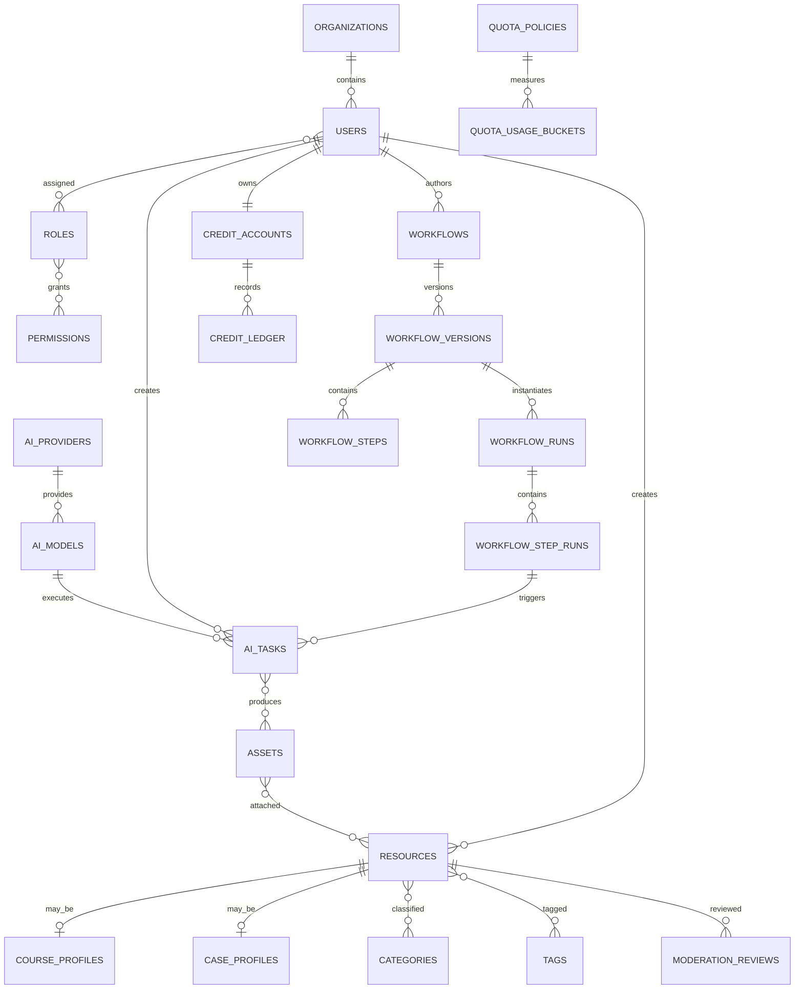

# 数据库架构设计

## 1. 设计原则

- PostgreSQL 是业务事实来源；生成文件本体只保存到对象存储。
- 所有主键使用 UUID，时间统一存 `timestamptz`，应用层展示时转用户时区。
- 核心内容使用软归档而不是物理删除；审计和额度流水不可修改。
- JSONB 用于模型差异参数和工作流配置，但用户、状态、归属、审核等可查询字段必须结构化。
- 多租户数据带 `organization_id`；平台公共内容允许该字段为空。

## 2. 核心 ER 图



## 3. 表分组

### IAM

| 表 | 用途 |
|---|---|
| `organizations` | 学校/机构租户；平台公共数据可不归属机构 |
| `users` | 用户身份、状态、基础资料 |
| `roles` / `permissions` | RBAC 定义 |
| `user_roles` / `role_permissions` | RBAC 关联 |
| `refresh_tokens` | 登录会话，只保存 Token 哈希 |

### AI、额度和成本

| 表 | 用途 |
|---|---|
| `ai_providers` | 厂商及密钥引用、可用状态 |
| `ai_models` | 模型能力、参数 Schema、路由配置 |
| `model_price_rules` | 随时间生效的计费版本 |
| `ai_tasks` | 一次生成任务及输入输出摘要 |
| `ai_task_assets` | 任务输入/输出文件 |
| `quota_policies` | 平台/组织/角色/用户的限额规则 |
| `quota_usage_buckets` | 每个周期的预占和已使用量 |
| `credit_accounts` | 用户积分账户摘要 |
| `credit_ledger` | 不可变的预占、消费、释放、调整流水 |

额度和积分是两个概念：额度用于“这个周期最多能用多少”，积分用于“当前可消费余额和成本”。即使 MVP 只展示一个“额度”数字，底层也建议分开，避免后期成本结算重构。

### 工作流

| 表 | 用途 |
|---|---|
| `workflows` | 稳定业务标识、作者、可见性 |
| `workflow_versions` | 草稿/发布版本及工作流图 |
| `workflow_steps` | 某版本的步骤定义 |
| `workflow_runs` | 用户对某个发布版本的一次学习/创作 |
| `workflow_step_runs` | 每一步的输入、输出、状态、尝试次数 |

### 资源与审核

| 表 | 用途 |
|---|---|
| `assets` | 对象存储元数据、来源和安全状态 |
| `resources` | 课程/案例/素材/文章统一主表 |
| `resource_assets` | 资源附件及排序 |
| `course_profiles` / `course_versions` | 课程信息与不可变版本快照 |
| `course_sections` / `course_lessons` | 课程章节与课时 |
| `learning_project_profiles` / `learning_project_steps` | 项目式学习路径与步骤 |
| `course_enrollments` / `lesson_progress` | 用户选课与逐课时进度 |
| `project_enrollments` | 项目学习进度和已完成步骤 |
| `generation_outputs` | AI 生成结果与课程课时/项目步骤关联 |
| `case_profiles` | 案例的创作来源、工作流、参数摘要 |
| `categories` / `tags` | 学科树与标签 |
| `resource_categories` / `resource_tags` | 多对多关联 |
| `resource_favorites` / `resource_counters` | 收藏关系与聚合计数 |
| `moderation_reviews` | 审核申请、快照、结果和理由 |
| `audit_logs` | 管理和敏感操作审计 |

## 4. 关键约束

1. `workflow_versions(workflow_id, version_no)` 唯一；已发布版本禁止原地修改。
2. `workflow_steps(workflow_version_id, step_key)` 唯一，运行记录靠稳定 `step_key` 对应。
3. `ai_tasks(user_id, idempotency_key)` 唯一，客户端重试只能得到同一任务。
4. `credit_ledger(idempotency_key)` 唯一，保证队列重复投递不重复扣费。
5. `resource_favorites(user_id, resource_id)` 唯一。
6. 同一资源同一时刻最多一个 `pending` 人工审核，可通过部分唯一索引保证。
7. `quota_usage_buckets` 使用原子条件更新：只有 `used + reserved + request <= hard_limit` 才能预占成功。
8. 对象存储的 `storage_key` 唯一；相同内容可用 `sha256` 辅助去重，但私有资产不能仅凭哈希跨用户复用授权。

## 5. 额度并发算法

预占必须在单个数据库事务内完成：

```sql
UPDATE quota_usage_buckets
SET reserved = reserved + :cost,
    updated_at = now()
WHERE policy_id = :policy_id
  AND user_id = :user_id
  AND window_start = :window_start
  AND used + reserved + :cost <= hard_limit
RETURNING id;
```

未返回记录表示额度不足。若周期桶尚不存在，使用 `INSERT ... ON CONFLICT ... DO UPDATE`，并保持相同条件。Redis 可以做前置快速限流，但最终扣量必须以 PostgreSQL 原子更新为准。

任务成功：`reserved -= estimate`，`used += actual`；任务失败：`reserved -= estimate`。两者都写 `credit_ledger` 并校验幂等键。

## 6. 索引建议

- `resources(status, visibility, published_at desc, id desc)`：资源列表游标。
- `resources(organization_id, status, updated_at desc)`：后台内容管理。
- `ai_tasks(user_id, created_at desc)`：个人生成历史。
- `ai_tasks(status, next_poll_at)`：Worker 拉取待轮询任务。
- `workflow_runs(user_id, updated_at desc)`：继续学习。
- `moderation_reviews(status, submitted_at, id)`：审核队列。
- `audit_logs(actor_user_id, created_at desc)` 与 `audit_logs(target_type, target_id)`。
- 对 `resources.title/summary` 建 trigram GIN；复杂中文分词需求出现后迁移至搜索引擎。

高增长表 `ai_tasks`、`credit_ledger`、`audit_logs` 可以按月分区，但不建议在 MVP 提前分区。

## 7. 数据保留与删除

- 用户注销先禁用账号并撤销会话；法定保留期后异步匿名化个人字段。
- 审计和计费记录保留主体 UUID 及必要快照，但清除无关个人信息。
- 私有原始生成文件可按套餐设置保留期；公开案例引用的资产不可随任务历史清理。
- 删除资源时先归档并撤销公开访问；对象存储由引用计数/延迟清理任务回收。

## 8. 迁移策略

- 每次发布只允许向前兼容迁移：先加字段/表，再发兼容代码，最后清理旧字段。
- 大表添加非空字段采用“可空字段 → 后台回填 → 约束验证 → 设为非空”。
- 枚举状态变化频繁时应改用字典表；当前 SQL 枚举适合首期状态稳定的核心流程。
- 生产迁移、回滚说明和数据修复脚本必须进入代码评审。

完整可执行草案见 [`database/schema.sql`](../database/schema.sql)。
